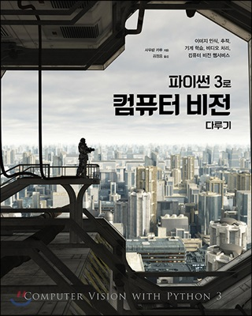

## 📚 파이썬3로 컴퓨터 비전 다루기
### Content



---------------

본 책에서 나온 코드들을 정리한 repo입니다. 더 자세한 코드나 영문 서적을 참고하시고 싶으시다면 [여기](https://github.com/PacktPublishing/Computer-Vision-with-Python-3)

✔ 파이썬 3로 컴퓨터 비전 다루기에 나온 코드들을 전부 2021년 기준으로 수정

* Keras → Tensorflow 2.0
* Patented 알고리즘(SIFT, SURF)은 특정 버전에만 존재합니다. 최신 버전인 OpenCV 4.#.# 이상에서는 지원하지 않습니다.
* Scikit-image 2.0 기준으로 재작성하였습니다.

✔  본 책은 **머신러닝과 영상처리**에 대한 기본 지식을 가지고 읽으면 간단하게 읽을 수 있습니다! 스타트를 끊기에는 좋은 책으로 추천드립니다!

✔ 코드와 이미지를 함께 보여드리기 위해 Jupyter Notebook으로 작성하였습니다.

### Getting Started

시작하기 전 라이브러리를 설치해주세요 (자세한 내용은 각 단원별 노트북 참고)

```
pip install Pillow
pip install scikit-image
pip install sklearn
pip install tensorflow
pip install opencv-contrib-python
```

### Dependencies
Python 3.7  
Opencv 4.4.0  
Tensorflow 2.3.1 
Pillow 8.0.1  
Scikit-image 0.18.1  
Scikit-learn 0.23.2  


